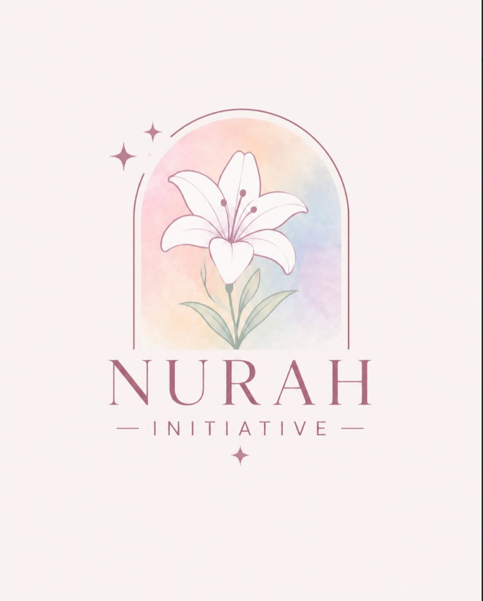

<div align="center">
  
  <h1>Nurah Initiative</h1>
  <p><strong>Youth-Led Movement for Community Support, Social Awareness & Youth Empowerment</strong></p>
  <p>
    <a href="https://www.nurahinitiative.com"><strong>www.nurahinitiative.com</strong></a>
  </p>
</div>

---

## 🌟 About Nurah Initiative

**Nurah Initiative** is a youth-led social impact movement centered around turning individual actions into a collective movement for positive change. We believe that every person deserves the opportunity to live with dignity, hope, and purpose.

### Core Focus Areas
- 🌸 **Supporting Communities**: Direct service and assistance for communities in need.
- 📢 **Raising Awareness**: Educational campaigns and research briefs on vital social issues.
- 👥 **Empowering Youth**: Platform and leadership pathways for young change-makers.
- ✨ **Creating Collective Change**: Uniting individual care, service, and advocacy into lasting impact.

---

## ✨ Key Features & Architecture

- **Clean SEO Routing (Zero `#` Hash Links)**: Powered by `react-router-dom` with 100% hash-free URLs (`/`, `/about`, `/mission`, `/projects`, `/resources`, `/team`, `/volunteer`, `/contact`, `/donate`).
- **Logo-Derived Design System**: Custom HSL and HEX color palette strictly derived from the brand logo (`#8C5260`, `#FAF2F0`, `#E2A9B8`, `#FED6BB`, `#C5D4EB`, `#9DAB99`).
- **Research & Knowledge Hub (`/resources`)**: Searchable repository of research articles, policy briefs, and advocacy guides.
- **Impact Projects Showcase (`/projects`)**: Categorized listing of active and planned community initiatives.
- **EasyPaisa Donation System (`/donate`)**: Built-in 1-click copy system for EasyPaisa transfer (`03001107814` — *Khair un Nisa*).
- **Leadership & Team Section (`/team`)**: Showcasing founders and directors with custom portrait cards.
- **Discreet Form Submissions**: Silent background dispatching for volunteer inquiries without exposing email addresses to site visitors.
- **Fluid Micro-Animations**: GSAP scroll triggers and smooth responsive interactions.

---

## 🛠️ Tech Stack

- **Frontend Framework**: [React](https://react.dev/) + [Vite](https://vitejs.dev/)
- **Styling**: [Tailwind CSS v4](https://tailwindcss.com/) + Custom HSL Design Tokens
- **Routing**: [React Router v7](https://reactrouter.com/)
- **Animations**: [GSAP](https://greensock.com/gsap/) + [ScrollTrigger](https://greensock.com/scrolltrigger/)
- **Icons**: [Lucide React](https://lucide.dev/)
- **Effects**: Canvas Confetti

---

## 🚀 Getting Started

### Prerequisites
- Node.js v18+ 
- npm or yarn

### Installation

1. **Clone the repository**:
   ```bash
   git clone https://github.com/your-username/nurah-initiative.git
   cd nurah-initiative
   ```

2. **Install dependencies**:
   ```bash
   npm install
   ```

3. **Run local development server**:
   ```bash
   npm run dev
   ```
   Open `http://localhost:5173/` in your browser.

4. **Build for production**:
   ```bash
   npm run build
   ```

---

## 🌐 Deployment & Live Domain

This web application is optimized for deployment on **Vercel** or **Netlify** configured with single-page application (SPA) rewrite rules to support clean URLs.

### Target Live Domain
- Primary Domain: `https://www.nurahinitiative.com`

---

## 📜 Credits & Attribution

- **Initiative**: Nurah Initiative
- **Development**: Developed by [Yawar Abbas](https://yawarabbass.vercel.app)
